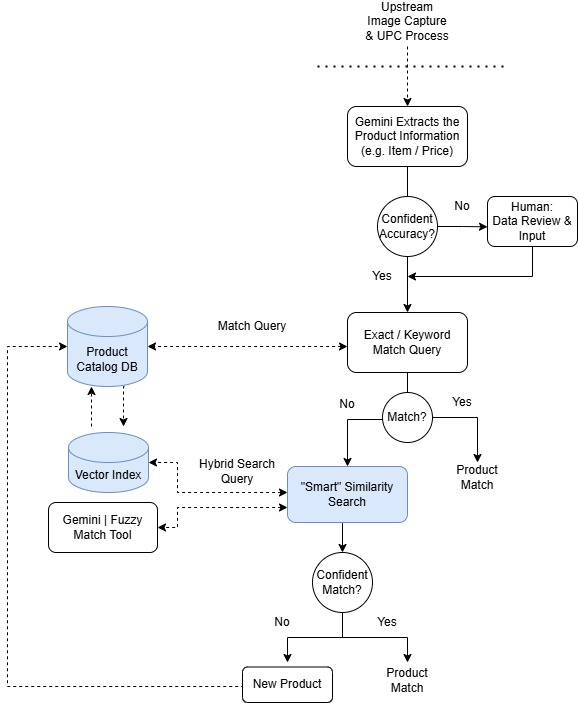

# instore-product-similarity-search

This repository focuses on leveraging Gemini and Vertex AI Vector Search for in-store product similarity search. It builds a pipeline to process product catalog data, generate embeddings, and query the index using structured data extracted from shelf images.

## Sample Workflow

This repo focuses on the highlighted areas of the workflow below.

## Getting Started

Explore the Jupyter notebooks to understand the end-to-end process.

*   **[00_data_prep.ipynb](./notebooks/00_data_prep.ipynb)**: This notebook prepares the raw product catalog data. It cleans text fields (decoding HTML, removing noise), structures the product hierarchy, and exports a JSONL file ready for embedding generation.
*   **[01_product_index.ipynb](./notebooks/01_product_index.ipynb)**: This notebook generates vector embeddings for the product catalog using the `gemini-embedding-001` model. It then creates and deploys a Vertex AI Vector Search Index to enable fast similarity matching.
*   **[02_product_query.ipynb](./notebooks/02_product_query.ipynb)**: This notebook demonstrates the query phase. It takes a product description (extracted from an image via Gemini), generates a query embedding, searches the deployed index for the most similar products, and maps the results back to the original catalog details.
